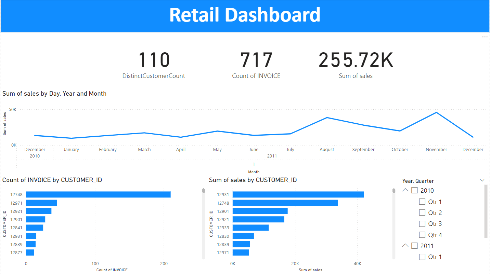

# Analyzing Customers Purchasing Transactions Behavior Using Analytical SQL

## Problem Statement
The purpose is to analyze customer purchasing transactions and gain insight into customer behavior to efficiently and proactively target customers, with the goal of increasing sales/revenue, improving customer retention, and reducing churn.

## Datasets
- **Customers Data folder** contains all datasets used in this analysis.
    - **OnlineRetail**: An OnlineRetail dataset contains 12858 rows of retail transactions data. Each row represents a purchase made by a customer and includes information such as the invoice number, stock code, quantity, invoice date, price, customer ID, and country.
    - **DailyCustomers**: The DailyCustomers dataset contains 574396 rows of daily purchasing transactions data for customers. Each row represents a purchase made by a customer and includes information such as the customer ID, purchasing date, and the amount.

## Project Steps
1. **Exploring the OnlineRetail Dataset**: Apply business meaningful analytical queries to understand the data and perform different analyses.
2. **Implementing the RFM Segmentation model**: Separate a group of customers into subgroups according to their behavior for product purchasing.
3. **Calculating maximum consecutive days a customer made purchases**.
4. **Calculating the number of days or transactions to reach a spent threshold of 250 LE**.
5. **Creating visuals and charts**: To aid in understanding the datasets, analysis, and changes.

## Project Files
- **Customer Data**: Contains the used datasets.
- **Customers Transactions Analysis Report**: Contains the business story, analyzing queries business meaning, data charts, and conclusions.
- **Output_Data**: Contains all data exported from different analysis methods.
- **Queries Explanation**: Contains SQL queries used for the analysis, description for each query, and how it works.
- **SQL Queries**: A .sql file containing queries with clear comments.

## Tools and Technologies
- SQL.
- Analytical SQL Functions.
- CTEs.
- Window Functions.
- Toad.
- Power BI.

